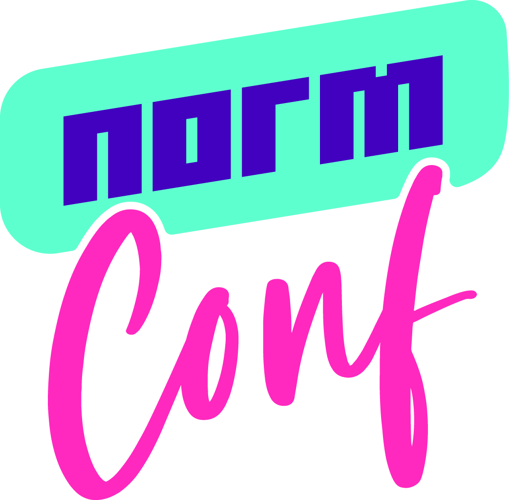

# awesome-normconf

A community-built list of resources coming out of [NormConf](https://normconf.com/) Slack

## Awesome Official NormConf

### Awesome Lightning Talks 

| Speaker | Talk Title | Talk Video | Slides | 
|---------|------------|------------|--------|
|Randy Au         | Everything is on fire and you get to contribute | [Video](https://youtu.be/-6sS3wVYpM8)          | [Slides](https://docs.google.com/presentation/d/1hmtZ1Hpm2M4lEEEHfVWl6-zX_aVhdjQQ5JxK8dUzqPM/edit?usp=sharing)        |
|[Anna Godwin](https://annagodwin.com/)         | Intro to PDF Text & Table Extraction | [Video](https://www.youtube.com/watch?v=rB_yaWEHhtM)          |  [Slides](https://github.com/annagodwin/normconf-intro-pdf/blob/main/NormConf%20Intro%20PDF%20Extraction.pdf)  / [Code Snippets](https://github.com/annagodwin/normconf-intro-pdf/blob/main/README.md)    |
|Jenny Bryan | How to name files like a normie | [Video](https://youtu.be/ES1LTlnpLMk) |  [Slides + more](https://github.com/jennybc/how-to-name-files) |
|Zachary Chetchavat| Hotkeys for Spreadsheets Cookbook: Practical Solutions from CTRL-Arrow, to F4 | [Video](https://www.youtube.com/watch?v=HF0F4H8BNsE)|[Slides](https://docs.google.com/presentation/d/1lK-fz0t154UkB5NoyKmNFArbDfHGmGTtgE-5GifveQQ/edit?usp=sharing)|
|[Amanda Alvarez](https://gecky.me/about/)         | Minimizing the Cost Function in Data Projects (or, Keep it Simple, Stupid) | [Video](https://www.youtube.com/watch?v=Z-xnFdtCL0o)            |[Transcript](https://gecky.me/posts/lightning-talk/)        |
|[Victor Geislinger](https://github.com/MrGeislinger) | Persistent SSH Sessions w/ tmux | [Video](https://www.youtube.com/watch?v=vRhe4QYrXfM) |[Slides](https://docs.google.com/presentation/d/1Sq-zKNoDYf3AWM6qaUnFmeue5EsKJAKfPm-EZlG7TnI/edit?usp=sharing) / [Code Snippets](https://gist.github.com/MrGeislinger/45253dc84d61c48c6a63abc8acb423aa) |
| Lucila Stancato        | The night I accidentally killed a Kubernetes service and realized 3 days later | [Video](https://www.youtube.com/watch?v=gYk32uHcL6E)           |    [Slides](https://github.com/normconf/awesome-normconf/blob/main/slides/lightning-talk-lucila-stancato.pdf)    |
| Georg Meyer | A Case for Beauty in IT | [Video](https://youtu.be/B6H4ZFawoNE) |        |
|[Nicolò Giso](https://www.nicologiso.com/essays/bio/)         | random.randint(5, 12) lessons I learned as a Data Scientist in 5 years in industry | [Video](https://www.youtube.com/watch?v=_nvgKmedPfw)           | [Slides](https://drive.google.com/file/d/1T7iZcSIT0NNBZoAr9hAPXfGpr3aZJZDF/view?usp=sharing)        |
|         |            |        |
|         |            |        |
|         |            |        |
|         |            |        |
|         |            |        |
|         |            |        |
|         |            |        |
|         |            |        |
|         |            |        |

+ Awesome Speaker Decks
+ Awesome NormConf Talks

## Awesome Unofficial NormConf

+ Awesome Hallway Talks
  + [The Best Data Pipeline is the One You Do By Hand](https://youtu.be/sHD1O1L2Uu4) by [Taylor Murphy](https://twitter.com/tayloramurphy)
  + [Stop using Random Splits!](https://youtu.be/Wyazme2GOlA) by [Jesper Dramsch](https://tech.lgbt/@jesper)

## Awesome Blogs and Newsletters

+ https://github.com/AlexMolas/ml-blogs
+ https://koaning.io
+ https://calmcode.io
+ https://pythonspeed.com/docker/

## Awesome NormConf Repositories

+ [Metrics Are Born at Sea But Stored In the Cloud](https://www.youtube.com/watch?v=JANC6DNJC0o) comes with a [repository](https://github.com/luis-mueller/normconf-2022) for DIY metric logging and plotting.
+ [Doubtlab](https://github.com/koaning/doubtlab/) helps you find doubtful labels in training data. 

## Awesome NormConf Extras

+ [Bingo Card Template](https://docs.google.com/document/d/16DbU2xWBabk-R2FqmpAlOJoPqEnToxQ5qDJiVQu9NKI/edit?usp=sharing)
+ [Interest Level Planning Tool for Talks](https://docs.google.com/spreadsheets/d/1IFB8oEnyceZQCCubdD5k4ToARZ4nV822alHFSl9nMus/edit?usp=sharing)
+ [NormConf Bingo Streamlit App](https://normconf-bingo.streamlit.app/)
+ [How to use a screenbrush during tech talks](https://calmcode.io/content/draw.html)
